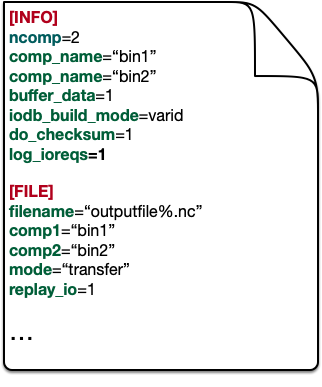

How to Use
==========

One of the significant characteristics of the DTF library is that it's easy to use.
There are only three steps required to adopt the DTF data transfer to a multi-component workflow.

Step One: Prepare a configuration file
--------------------------------------
User should prepare a configuration file to provide the basic information about the workflow to the DTF library and switch on/off DTF functionalities by key-value pairs.
Figure :numref:`config_file` gives a simple example of a configuration file.

.. _config_file:

	
	An example of a DTF configuration file.

Step Two: Insert three DTF function calls 
-----------------------------------------

Three intuitive DTF function calls should be inserted into the source code of each component of a mutli-component system.
These three functions are:

Step Three: Compile your code
-------------------------------

A Code Example
--------------
