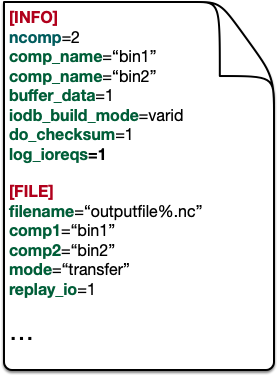

How to Use
==========

One of the significant characteristics of the DTF library is that it's easy to use.
There are only three steps required to adopt the DTF data transfer to a multi-component workflow.

Step one: Prepare a configuration file
--------------------------------------
User should write a configuration file to provide basic information about the workflow to the DTF library and define it`s runtime behavior.

.. _config_file:

	
	An example of a DTF configuration file.

Step two: Insert three DTF function calls 
-----------------------------------------

Three intuitive DTF function calls should be inserted into the source code of each component of a mutli-component system.
These three functions are:

