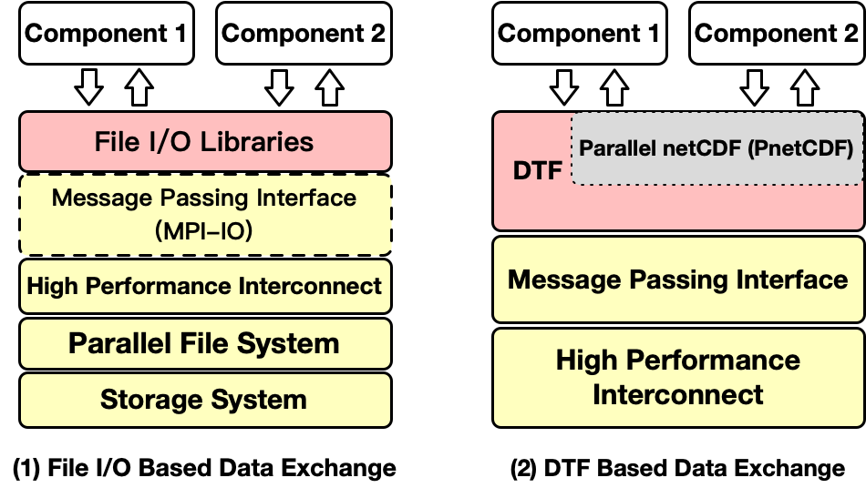

.. _background:

Background and Motivation
=========================

**Data Transfer Framework (DTF)** is an I/O middleware designed for achieving scalable and high-speed data transfer between application components in multi-component workflows. 
Multi-component workflow is becoming a popular computation model in High Performance Computing (HPC), in which multiple independently developed application components are coupled together to perform more sophisticated and complex computations (e.g. data assimilation based weather prediction system).

In such workflows, massive computation data generated by a component during execution need to be transferred to the other as the input data to the subsequent computations.
However, the implementations of inter-component data exchange in most of the multi-compoenent systems are either based on file I/O through parallel file system or specifically designed coupling softwares.
Both of the approaches have pros and cons.
Due to the fact that coupled application components are usually developed by different research teams, file I/O became the easiest approach, which exchanges data through file systems using high-performance parallel I/O libraries (e.g. PnetCDF and HDF5).
The major drawbacks of file I/O based approach are low speed and inefficiency because the reader components have to wait until the writer component finishes its data writing process.
Coupling softwares can be deployed to overcome the mentioned shortcomings of file I/O based data transfer.
However, the I/O kernels of existent multi-component systems are required to be largely modified using the dedicated Application Programming Interfaces (APIs) provided by coupling softwares.
There exists a pressing need for an easy-to-use and and highly efficient approach to minimize the drawbacks mentioned above and transfer massive computation data between application components.

The design of DTF combines the advantages of file I/O and coupling software, which aims at minimizing the modification of existing I/O kernels in multi-component systems and providing high-speed high-efficiency inter-component data transfer.
The current implementation of DTF works with multi-component systems whose inter-component data transfer is built upon Parallel NetCDF I/O (PnetCDF) library.
Instead of using file systems, DTF takes full advantage of high-performance interconnects in HPC and transfers data using Message Passing Interface (MPI), which transparently redirects PnetCDF file I/O operations to message passing. A graphical comparison of file I/O and DTF based inter-component data transfer is shown in :ref:`fileio-dtf`.

.. _fileio-dtf:

    
    Difference between File I/O and DTF based inter-component data exchange.

This documentation assumes that the reader knows the basic usage of PnetCDF library.
An detailed overview of DTF design will be introduced in the next section :ref:`overview`.
