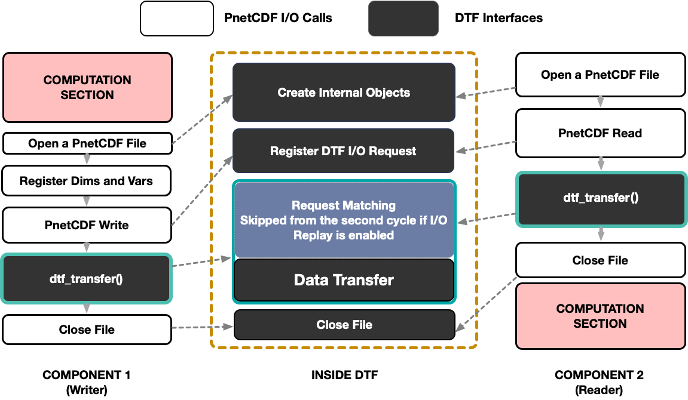

Step Two: Insert three DTF function calls 
-----------------------------------------

The design of DTF aims to minimize code modification to the workflow.
To enable DTF data transfer, users are required to include the header file ``dtf.h`` and put three intuitive DTF function calls into the source code of each component.

The required DTF functions in C language are:

.. code-block:: c
	
	/*
	DESCRIPTION:
		Initialize the DTF library. This function should be called after MPI_Init().
	
	PARAMETERS:
		* [IN] filename - path to the DTF configuration file
	   	* [IN] module_name - name of the component which is calling this function;
			The value of this parameter must be one of the component names listed
			in the [INFO] section in the configuration file specified by `filename`.
	
	RETURN VALUE:
		* 0 - Initialization succeeded
		* 1 - Initialization failed
	*/

	int dtf_init(const char *filename, char *module_name);

	/*
	DESCRIPTION:
		Finalize the DTF library. This function should be called before MPI_Finalize().

	PARAMETERS:
		none
	
	RETURN VALUE:
		* 0 - Finalization succeeded
		* 1 - Finalization failed
	*/

	int dtf_finalize();

	/*
	DESCRIPTION:
		Command DTF to start transferring data of the file specified by the `filename`
		between the coupled components. This function is responsible for matching all 
		the I/O requests collected from PnetCDF read and write calls and transferring 
		data between the matched processes. Therefore, it should be called after all
		the I/O calls in each I/O session.
		The function returns on both side only when all the reader processes have
		received the requested data. Otherwise the execution will be hanging until
		all the requested data delivered or the timeout expires.

	PARAMETERS:
		* [IN] filename - name or name pattern of the PnetCDF file specified in the
				corresponding [FILE] section of the configuration file
		* [IN] ncid - PnetCDF file ID. The ID that is returned by the PnetCDF file
				create or open function

	RETURN VALUE:
		* 0 - the return value of this function is always zero. Applications will 
			abort if an error occurs during the function execution.
	*/

	int dtf_transfer(const char *filename, int ncid);

.. note::
	The I/O patterns of the coupled components may be different from each other, which means the writer component may write more data than the reader actually needs. ``dtf_transfer()`` tackles this situatioin smarter than file I/O based data transfer by only transferring data blocks that are explicitly requested by the reader components. Redundant data blocks will be ignored by DTF for higher data transfer efficiency.
	In some complex workflows, ``dtf_transfer()`` may be invoked multiple times during workflow execution when multiple I/O sessions are performed on different files. It's recommended that ``dtf_transfer()`` is invoked only once after all the PnetCDF I/O calls in each I/O session in concern of performance.

:numref:`dtf-pnetcdf` shows a simplified overview of a DTF-based workflow.

.. _dtf-pnetcdf:

	An brief overview of a DTF-based workflow.

.. warning::
	Users are responsible for deciding when ``dtf_transfer()`` should be called to ensure that by the time all the read requests collected can be covered by the collected write requests.
	Users should not modify or use the data buffers until ``dtf_transfer()`` is complete. Write buffers can be reused only if the ``buffer_data`` option is enabled in the DTF configuration file.
