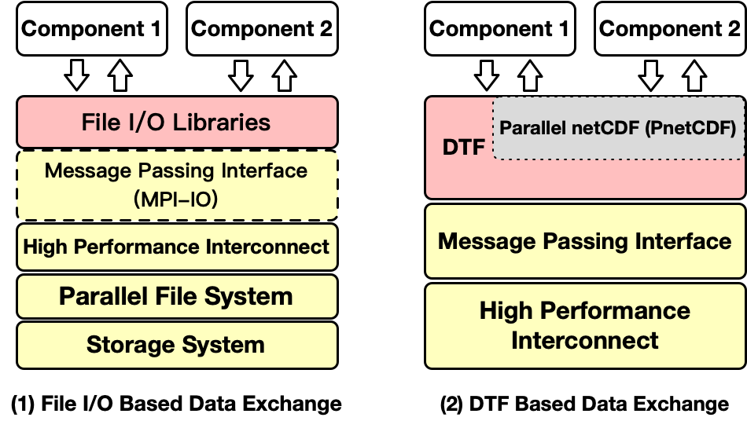

Introduction
============

**Data Transfer Framework (DTF)** is an I/O middleware designed for achieving scalable and high-speed data transfer between application components in multi-component workflows. 
Multi-component workflow is becoming a popular computation model in High Performance Computing (HPC), in which multiple independently developed application components are coupled together to perform more sophisticated and complex computations (e.g. data assimilation based weather prediction system).

It is implemented using Message Passing Interface (MPI), which transparently redirects PnetCDF file I/O operations to DTF library implementations.

