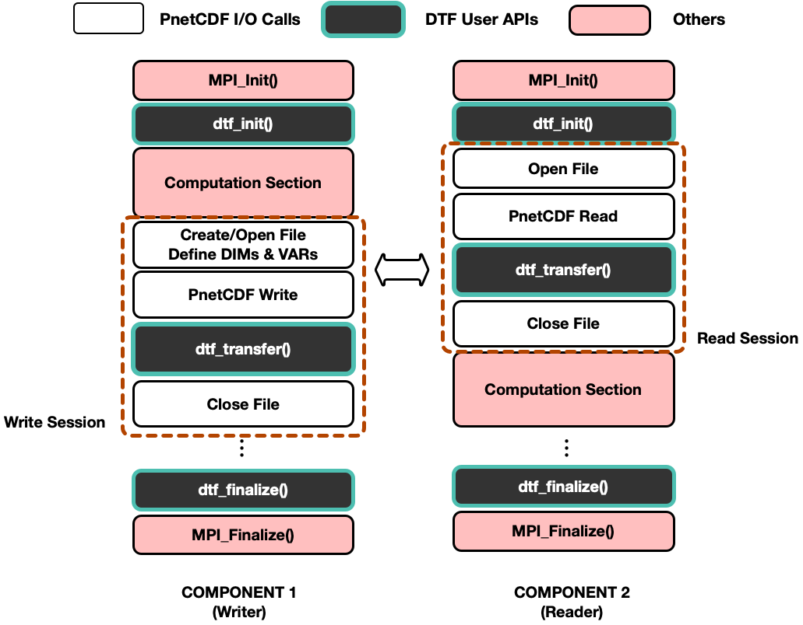

.. _overview:

Overview of DTF
===============

The original PnetCDF library uses MPI-IO under the hood, which allows multiple processes to write data to the same NetCDF file in parallel.
By compiling with the provided DTF-based PnetCDF library, original MPI-IO operations will be transparently redirected to message passing, which is implemented in the DTF library.

Instead of creating a new PnetCDF file on the disk, PnetCDF function calls during each I/O phase, such as ``ncmpi_open()``, ``ncmpi_def_dim`` and ``ncmpi_def_var``, which opens a file and defines PnetCDF dimensions and variables respectively, will be intercepted by the DTF library, and the metadata describing the 'file' will be stored in DTF data structures.
Intercepted PnetCDF I/O operation calls such as ``ncmpi_put_var()`` and ``ncmpi_get_var()`` will register each read or write operation as an I/O request object in the DTF library.

Each I/O request object contains the following metadata:

* ``varid``: the PnetCDF variable ID;
* ``rw_flag``: for distinguishing between read and write request;
* ``datatype``: requested data type;
* ``start``: corner coordinate of the requested data block;
* ``count``: length of the requested data block in each dimension;
* ``buffer``: address of the user buffer.

These collected I/O requests will be further used for matching read requests with their corresponding write requests, which will be introduced in the following subsection.

.. include:: request-match.rst

.. include:: io-replay.rst

A Typical DTF-based Workflow
----------------------------

:ref:`workflow` shows a typical model of a DTF-based workflow which couples a writer component and a reader component.

.. _workflow:

	A typical multi-component workflow model using PnetCDF-based DTF.

