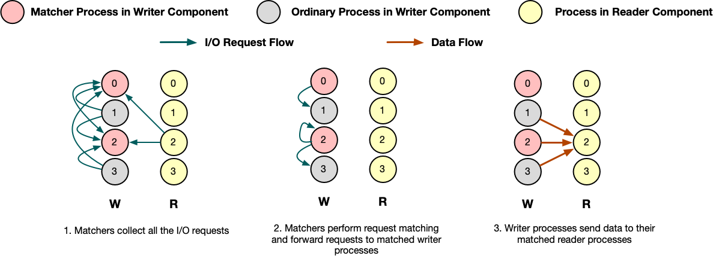

I/O Request Matching
--------------------
I/O request matching is one of the important features in DTF.
During execution, designated numbers of processes of the writer component will be delegated to collect all the I/O requests and match each read request against the corresponding write request(s) according to the metadata contained in each request as matcher processes.
The number of matcher processes can be adjusted by users.

For example, as shown in :numref:`request-m`, there are two matcher processes in the writer component.
Firstly all the writer processes and reader processes send their I/O requests to the corresponding matcher processes.
Matcher processes then perform request matching based on the ``start`` and ``count`` metadata contained in each read request and look for the corresponding write requests.
The requested data blocks of each read request may be matched with multiple write requests, each of which will write data to a sub-block of the requested array block.
In this example, the read request of process 2 of the reader component is matched against process 1, 2 and 3 of the writer component.
Once a match is found, the matcher processes will ask the writer process to send the requested data to the matched reader process.
After received the message from the matcher, the writer process will copy the requested data to the send buffer along with the metadata and sends to the reader process.
Once the requested data is delivered, the reader process will unpack the message and copy the data out from receive buffer.

    A request matching example.

For optimal performance, I/O requests are divided and distributed among the matcher processes. 
Each of the matchers is delegated to handle the I/O requests of a sub-block of the multi-dimentional variable.
There is a trade-off in this approach: request matching in parallel improves performance; However, if there are too many matchers the request may end up being split too many times resulting in more communication between readers and writers.
Therefore, users should be responsible to choose the best amount of matchers.
